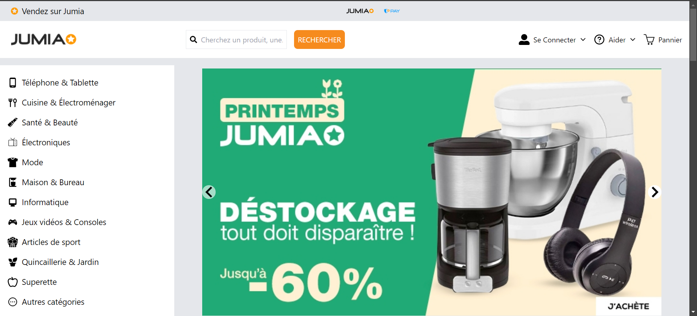

# Jumia Tunisia Clone

This is a clone of the Jumia Tunisia e-commerce website built using **React.js** with features like multi-carousel slideshows and responsive design. The project aims to replicate the core functionality of Jumia's online shopping platform with a focus on user-friendly UI and smooth navigation.

## Features

- Multi-carousel for displaying products.
- Image slideshow for product advertisements.
- Responsive design with Tailwind CSS.
- Modern shopping interface for users.

## Technologies Used

- React.js
- react-multi-carousel (for carousels)
- react-slideshow-image (for image slideshows)
- Tailwind CSS (for styling)

## Installation

1. Clone the repository.
2. Install dependencies using `npm install`.
3. Run the application using `npm run dev`.

## Usage

- Browse through various categories and products.
- View products in a responsive carousel format.
- Explore product advertisements with an image slideshow.

## Contributing

Contributions are welcome to enhance this project. Feel free to submit pull requests or open issues.

## License

This project is licensed under the [MIT License].
